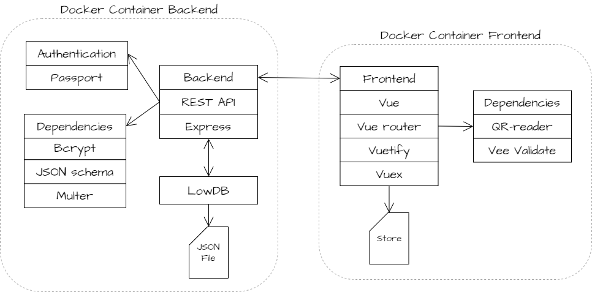
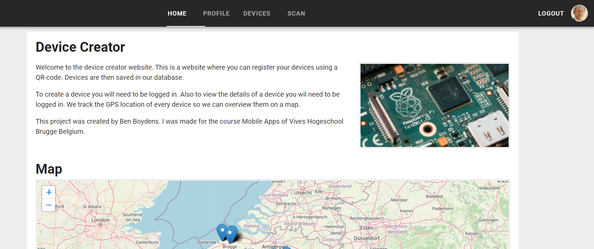
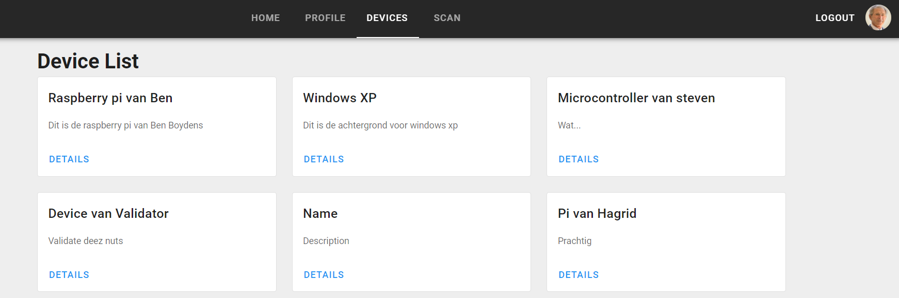
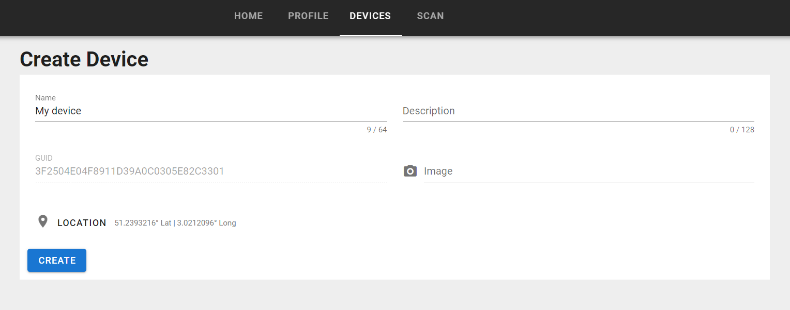

# Device creator Ben Boydens

Welcome this is the device creator app. This is an application where you can register all kinds of devices. You can view your devices and create new devices using a Vue frontend. To create and view new devices you will have to create an account.

Created by Ben Boydens for the class Mobile Apps for Vives Hogeschool.

## Service Diagram



## How to setup

The project can be easily be set-up for development using Docker. Just run the following command in same directory as the docker-compose.yml file.
```
docker-compose up --build
```

---
Alternatively you can install everything locally. Install everything for the frontend and backend with.
```
npm install
```

Run the development server for the frontend.
```
npm run serve
```

Build the frontend.
```
npm build
```

Run the development server for the backend.
```
npm run dev
```

## Frontend

Vue frontend using the following dependencies.
- bcrypt
- dotenv
- express
- jsonschema
- lowdb
- multer
- passport

Here you can see some screenshots of what the frontend looks like. This first image the homepage of the project. Here there is some text
explaining the application and a map where you can see the location of the current devices.



This is the device page. Here you can find all the current devices that are registered.



Finaly here is the page where you can register a new device. To get here you need to scan a QR-code first. To do this you need to be logged in.



## Backend

Backend uses in total 11 different routes. Last column is to know if the user needs to be logged in.

### Device Route

| Method | Route | Description | Login |
| ----------- | ----------- | ----------- | :-----------: |
| GET | /devices | Get a list of devices | ❌ |
| POST | /devices | Create a new device | ✔ |
| GET | /devices/{id} | Get a specific device with id | ✔ |

### User Routes
| Method | Route | Description | Login |
| ----------- | ----------- | ----------- | :-----------: |
| GET | /profile | Get the profile of the current logged in user | ✔ |
| POST | /register | Create a login | ❌ |
| POST | /login | Login to your account | ❌ |
| DELETE | /logout | Logout the current user | ❌ |

### Image Routes
| Method | Route | Description | Login |
| ----------- | ----------- | ----------- | :-----------: |
| GET | /images/{id} | Get a specific image with id | ❌ |
| POST | /images/upload | Upload a new image | ✔ |
| POST | /avatars | Upload an avatar image for your account | ❌ |

### Body format
POST /devices
```js
{
  name: "name",
  description: "description",
  guid: "xxxxxxxxxxxxxxxxxxxxxxxxxxxxxxxx",
  image: "image.jpg",
  location: {
    lat: 50,
    long: 35
  }
}
```

POST /register
```js
{
  email: "test@example.com",
  password: "myPassword",
  firstname: "Alice",
  lastname: "Bob",
  avatar: "image.jpg"
}
```

POST /login
```js
{
  email: "test@example.com",
  password: "myPassword"
}
```

POST /images/upload + /avatars

Must have header ```'content-type': 'multipart/form-data'``` and the image must be uploaded with the field name ```image```.

## TODO's

- Add a small map for setting the location when creating a new device.
- Authorization on certain pages. (Now everyone can access the create device page)
- Change the Image field of a device and the Avatar field of a user to a URL instead of a filename.
